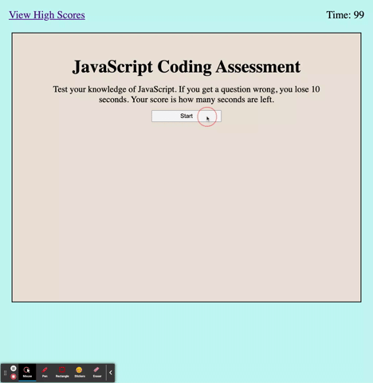

# Javascript Assessment

An app that's going to quiz you on JavaScript fundamentals. Once you start, a countdown timer will start. You will answer several different multiple choice questions. After you click on a question, the app will show if your answer was correct or wrong. If you get a question wrong, you lose 10 seconds. To continue, you click "next" to see the next question. Once you answer all of the questions or the time runs out, the assessment ends. You will see your score. You are able to submit your score with your initials. This score is saved in your local storage and you can see all of the high scores in the "high scores" link.



## Table of Contents

|                                         |                                                               |                                                   |
| :-------------------------------------: | :-----------------------------------------------------------: | :-----------------------------------------------: |
| [Introduction](#javascript-assessment)  |            [Table of Contents](#table-of-contents)            | [Development Highlights](#development-highlights) |
|         [Deployment](#deployed)         | [Description of Page Building](#Description-of-Page-Building) |       [Code Hightlights](#code-highlights)        |
| [Technologies Used](#Technologies-Used) |                      [Credits](#Credits)                      |                [License](#License)                |

## Development Highlight

- Use DOM Methods
- Save and Load data from local storage
- Use setInterval method as a timer countdown
- Loop through questions array and dynamically display one at a time on browser.

## Deployment

[Deployment](https://anusontarangkul.github.io/javascript-quiz/)

This app is deployed using GitHub pages.

## Description of Page Building

- .gitignore
- index.html
- score.html
- LICENSE
- README
- assets
  - css
    - score-style.css
    - style.css
  - gif
    - gif
  - js
    - app.js
    - score.js

There are 2 main pages for this app. Each of them have their own css styling and script.

## Code Highlights

An algorithim was needed to display the high scores from local storage. I created an empty array orderedScores to store the data. I looped through the localStorage and pushed each key value and score to the orderedScores. The score had to be passed to an integer. The orderedScores is now a 2D array with the sub array consisting of the initials and score. I sorted this array according to the second index.

```JavaScript
let orderedScores = [];

for (let i = 0; len = localStorage.length; i < len; ++i) {
    let initial = localStorage.key(i);
    let score = parseInt(localStorage.getItem(localStorage.key(i)));

    orderedScores.push([initial, score]);
}

orderedScores.sort(function (a, b) {
    return b[1] - a[1];
});
```

Here is the timer function that is called when the game begins. We check to see if the count is less than or equal to 0 so we can clear the timer and end the game. Otherwise, we adjust the text conent where we dynamically show how much time is left. This API is asynchronous so we can still continue the quiz as the timer happens.

```JavaScript
window.timer =
    setInterval(function () {
        if (startTimerCount <= 0) {
            clearInterval(window.timer);
            endGame();
        }
        timeEL.textContent = `Time: ${startTimerCount}`;
        startTimerCount--;
    }, 1000);

```

## Technologies Used

- [HTML](https://www.w3schools.com/html/)
- [JavaScript](https://www.javascript.com/)
- [CSS](https://www.w3schools.com/css/)

## Credits

|                           |                                                                                                                                                                                                       |
| ------------------------- | ----------------------------------------------------------------------------------------------------------------------------------------------------------------------------------------------------- |
| **David Anusontarangkul** | [ LinkedIn](https://www.linkedin.com/in/anusontarangkul/) [ GitHub](https://github.com/anusontarangkul) |

## License

[](https://opensource.org/licenses/MIT)
